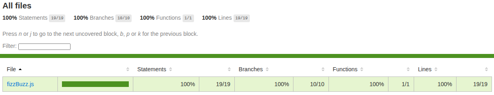

# 📚 Level Assessment | JavaScript & ES6

## 🎯 Assessment Objective

This exercise aims to evaluate your knowledge of modern JavaScript (ES6+), including DOM manipulation, control structures, loops, operators, object manipulation, functions, and error handling.

The exercises are designed to measure your understanding and application of these concepts without relying on memorization.

---

## 🚀 Deploy

[CLICK HERE TO ACCESS RESULT](https://diegoapaez.github.io/S4-Level-Assessment/)

## 🛠️ Getting Started

### 1️⃣ Clone this repository

```bash
git clone https://github.com/DiegoAPaez/S4-Level-Assessment.git
cd S4-Level-Assessment
```

### 2️⃣ Install Dependencies (Only required to run tests)

Make sure you have Node.js installed. Then install the packages:

```bash
npm install
```

## FizzBuzz with DOM Manipulation

### 📃 Description

This exercise aims to assess your knowledge of JavaScript, DOM manipulation, and error handling using try...catch. You will implement the classic "FizzBuzz" problem with a web interface where the user can enter a number and receive the response on screen.

### Features

-   Create an HTML page with an input field to receive a number, a button to process it, and a section to display the results.
-   Validate that the user can only enter numbers.
-   When the button is pressed, display the result on screen according to the FizzBuzz rules.
-   Maintain a history of the entered values and their respective results.

### Acceptance Criteria

-   _Functional_: If the entered number is divisible by 3, display Fizz.
-   _Functional_: If the entered number is divisible by 5, display Buzz.
-   _Functional_: If the entered number is divisible by both 3 and 5, display FizzBuzz.
-   _Functional_: If the entered number is not divisible by 3 or 5, display the number itself.
-   _Functional_: If the user enters a non-numeric value, an error message must be shown.
-   _Functional_: Display a history on screen with the entered values and their results.
-   _Technical_: Save each entered number in an object along with its result.
-   _Technical_: Handle errors using `<span>try...catch</span>`.
-   _Technical_: Implement a return structure with the following format:

    ```javascript
    {
    	status: "", // Success or error code
    	message: "", // Message
    	data: {
    		number: 0, // Evaluated number
    		result: "" // Expected result
    	}
    }
    ```

### Test Cases (Gherkin Format)

#### Feature: FizzBuzz Validation

##### Scenario: Number divisible by 3

    Given a number 9
    When the number is processed
    Then "Fizz" is displayed

##### Scenario: Number divisible by 5

    Given a number 10
    When the number is processed
    Then "Buzz" is displayed

##### Scenario: Number divisible by both 3 and 5

    Given a number 15
    When the number is processed
    Then "FizzBuzz" is displayed

##### Scenario: Number not divisible by 3 or 5

    Given a number 7
    When the number is processed
    Then "7" is displayed

##### Scenario: Non-numeric input

    Given an input "Hello"
    When the user tries to process the input
    Then an error message is displayed

##### Scenario: Input history

    Given a number 9 and a number 10
    When the user enters them sequentially
    Then the history displays "9: Fizz" and "10: Buzz"

### ✅ Coverage Report



## ⏳ Project Status

 
